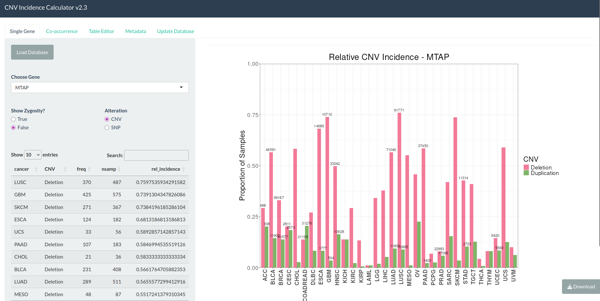
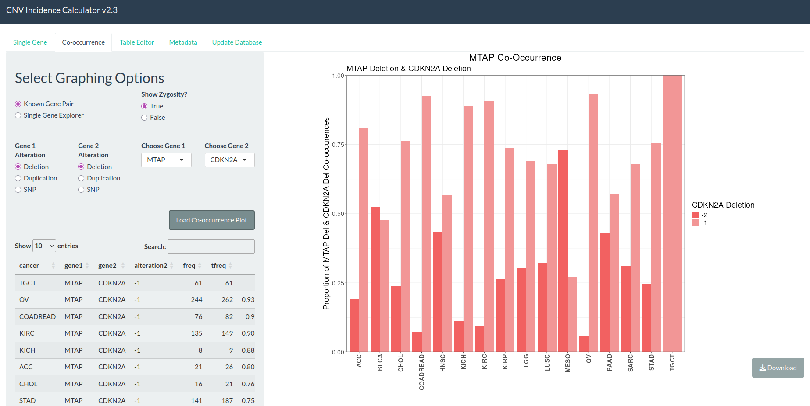
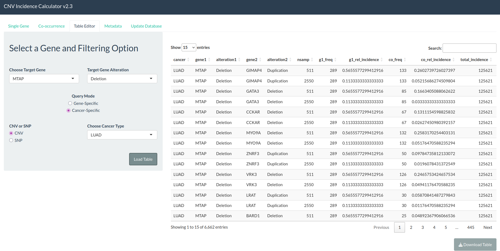
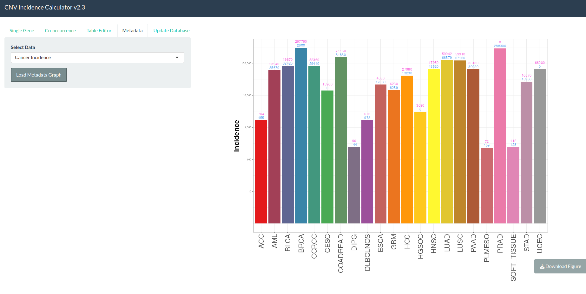
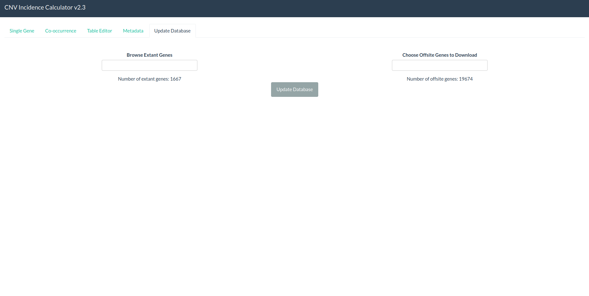

# CNV CALCULATOR

This repo contains the software side (no data products) of the CNV calculator. This software allows the user to set up their own PSQL database hosting CNV data from multiple cancers. It also requires some data from SEER to calculate relative incidences of cancer-gene alteration pairs. The goal is to provide an intuitive workflow for analyzing population level cancer genetics. 

### Features
 - docker-compose environment for easy set up and maintainability
 - nginx authentication to screen bots
 - shiny interface to allow interactive graphics
 - postgres database to optimize read times

### Workflow

CNV calculator is designed to be used in the drug discovery process of oncological pharmacology by estimating the incidence of specific gene alterations (SNPs, Duplications, Deletions) within cancer populations. It handles not only single gene specific queries but also dual gene queries, allowing the user to search for prevalent combinations of genetic alterations. Not only can it estimate how frequent a genetic alteration occurs in a cancer population, it also uses prevalence rates to estimate how many patients will be diagnosed with a specific cancer-gene alteration profile. Futhermore, the software is built to scale on whatever size server is available by narrowing or widening the total number of genes analyzed. The database can be edited safely through the built in GUI which downloads public domain data to your local machine at the scale that fits your needs. 

